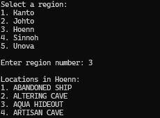
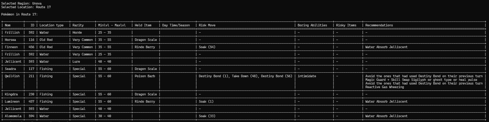
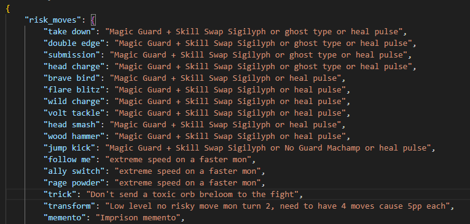

# PokeMMO-NoMoLostShinies
A pokedex/shiny hunting helper in python for CLI

# Prerequisites
- Python 3.x
- Python libraries "colorama" and "tabulate" (there is a requirement.txt)

For the non-tech people, here's a simplified version : 
You need python, for that, you can just download the latest version from the Microsoft Store which is the version 3.12 at the following link : https://www.microsoft.com/store/productId/9NCVDN91XZQP?ocid=pdpshare

Then, you just have to navigate to the folder in which you have downloaded the code, right click->show more options->Open in terminal
Then you just have to copy paste the following command : 
You can just go and use :
```
pip install -r requirements.txt
```
Once it's done, you just have to launch the script with python as seen in the next part

# Usage
Once you have clone the repository and downloaded the prerequisite (or pip install -r requirements.txt), you can just launch the script at the root of the folder like this 
```
python main.py
```

You will have to select the region you will be shiny hunting in, then the area.




The table will show you every revelant data concerning the pokemons you will be able to encounter such as held items, lvl, type, rarity, ... as seen in the dex, like a reverse dex where you search by location instead of Pokemons.

But the true value is in the 4 last columns as they will indicate what risky moves, items or boring abilities the mon can have, based on his dex data.

The last column contains recommendations for every scenarios so you can get prepared and not risk a lost shiny that you didn't expected or didn't prepared well enough for.
It used the "recommendation.json" file to give custom countermeasure


# Tips
I advise you to zoom out a bit on the terminal, so the table have enough space to be rendered properly, I'm going to work a bit on that later, or keep the change for the V2


# Roadmap
- V1 : I planned to call this a V1, a python script, clean, that does what I want.
- V2 : When I'll consider it finished, I'll port this to a webapp as a V2, maybe with wome React, so that way I can make it better at handling a table, maybe I'll use cards or else, adding the shiny sprites .gif, ...
- V3 : When I'll arrive at a V2 that is good enough, I'll probably move on to the V3 which will be a toast notification like the GEC is doing to integrate the script to the PokeMMO windows and have it automatically define the region you are in and the risk you can have, using OCR and Pygames is my idea for now and I have explored it already